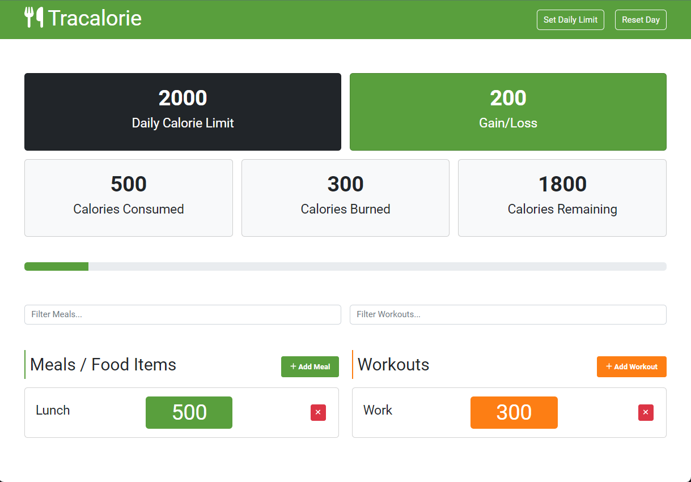

# TrackCalorie App

Aplicación web para llevar un registro de las calorías consumidas durante el día. Esta aplicación permite agregar, editar y eliminar comidas (calorias consumidas) y entrenamientos (calorías quemadas). Además, muestra el total de calorías consumidas durante el día.

Este proyecto es parte del curso **Modern JS From The Beginning 2.0** de [Brad Traversy](https://www.traversymedia.com/)

## Interfaz de usuario

## Tecnologías

- HTML
- CSS
- JavaScript
- Bootstrap 4
- Babel
- Webpack
- MiniCssExtractPlugin
- Node.js

## Uso

Aplicación desplegada en [TrackCalorie App](https://dazzling-frangipane-1cfc43.netlify.app/)
